# Examples

All examples require the MCP broker running on ports 3098 (HTTP) and 3099 (WebSocket). Start it first from the project root:

```bash
# From mcp-broker root
npm run dev
```

Then run examples from this directory:

```bash
cd examples
npm run <script>
```

## Overview

| Example | Type | Description | Prerequisites |
|---------|------|-------------|---------------|
| [list-tools.js](#list-tools) | Standalone | Lists all connected broker-clients and their tools | Broker |
| [hello-world/](#hello-world) | RC + Client | Publishes `greet` and `add` tools, calls them from a standard MCP client | Broker |
| [simple-service/](#simple-service) | RC | Long-lived service with `ping`, `exit`, and `chat` tools | Broker |
| [ollama/](#ollama) | RC | Wraps local Ollama API as an MCP `generate` tool | Broker, Ollama |
| [ai-invoke/](#ai-invoke) | RC + Client | AI generates and evaluates JavaScript from natural language | Broker, Ollama MCP server |
| [conversation-speaker/](#conversation-speaker) | RC + Client | Multi-persona AI conversation with TTS output | Broker, Ollama MCP server, Kokoro TTS |
| [chrome-ext-demo/](#chrome-extension-demo) | Extension | Chrome MV3 extension that injects broker-clients into web pages | Broker, Chrome |

**RC** = Broker-Client (publishes tools via WebSocket)
**Client** = Standard MCP client (consumes tools via HTTP)

---

## list-tools

A standalone utility that connects to the broker and prints all registered clients and tools.

```bash
npm run ls
```

---

## hello-world

The foundational example. A broker-client publishes `greet` and `add` tools. A standard MCP client discovers and calls them through the broker.

**Files:** `broker-client.js`, `mcp-client.js`, `demo.js`, `demo-stepwise.js`, `serve.js`

```bash
# All-in-one
npm run demo

# Or step-by-step
npm run broker-client   # Terminal 2
npm run client           # Terminal 3
```

| Script | Description |
|--------|-------------|
| `npm run demo` | All-in-one demo (server + RC + client in one process) |
| `npm run demo:stepwise` | Orchestrated 3-step demo |
| `npm run broker-client` | Start just the broker-client |
| `npm run client` | Run just the MCP client |
| `npm run serve` | Start server + broker-client together |

---

## simple-service

A minimal long-lived broker-client — the simplest starting point for building your own.

**Files:** `simple-service.js`

```bash
npm run service
```

**Tools:** `ping` (health check), `exit` (graceful shutdown), `chat` (AI via broker chat proxy)

Demonstrates auto-reconnect and graceful SIGINT handling.

---

## ollama

Wraps the local Ollama REST API as an MCP tool. Any MCP client can call `generate` without knowing about Ollama.

**Files:** `ollama-rc.js`

```bash
npm run ollama
```

| Variable | Default | Description |
|----------|---------|-------------|
| `OLLAMA_URL` | `http://localhost:11434` | Ollama API base URL |
| `OLLAMA_MODEL` | `qwen2.5:14b` | Default model |

---

## ai-invoke

A broker-client that publishes an `invoke` tool. Given a natural language instruction, it asks the AI to generate JavaScript, evaluates it, and returns the result.

**Files:** `ai-invoke-rc.js`, `ai-caller.js`

**Requires:** Ollama MCP server on port 3042

```bash
npm run ai-invoke    # Terminal 2
npm run ai-caller    # Terminal 3
```

```
MCP Client → broker → ai-invoke RC → rc.chat() → broker → Ollama → code → eval → result
```

---

## conversation-speaker

Four AI personas (Marcus the Manager, Sarah the Supervisor, George the Developer, Emma the Browser Worker) have a multi-turn discussion with TTS output. Each persona has a distinct voice, role, and conversation style.

**Files:** `conversation-speaker.js`, `conversation-10min.js`

**Requires:** Ollama MCP server on port 3042, Kokoro TTS on port 3021

```bash
npm run speaker
```

**Tools per persona:** `marcus`, `sarah`, `george`, `emma` — each generates a contextual AI response spoken in their unique voice.

**Additional tools:** `reset` (clear history), `show` (full transcript)

`conversation-10min.js` runs an automated 3-minute round-robin discussion between all four personas.

---

## chrome-extension-demo

A Chrome MV3 extension that injects broker-clients into web pages. Includes a clock page demo with two scenarios: triggering page actions via MCP tools, and iterative AI property resolution.

**Files:** `clock.html`, `clock.js`, `inject.js`, `property-rc.js`, `mcp-browser-client.js`, `manifest.json`, `popup.html`, `popup.js`, `background.js`, `auto-announce.js`, `click-announce.js`, `serve-chrome.js`

```bash
# Start broker + auto-announcer
npm run serve:chrome

# Load extension in Chrome
# chrome://extensions → Developer mode → Load unpacked → select chrome-ext-demo/
```

| Script | Description |
|--------|-------------|
| `npm run serve:chrome` | Starts broker + auto-announcer |
| `npm run auto-announce` | Runs just the auto-announcer (calls clickAnnounce every 15s) |
| `npm run click` | One-shot clickAnnounce call |

Demonstrates browser-injected broker-clients, remote page control from Node.js, and iterative AI property resolution via multi-turn `rc.chat()`.

---

## Appendix: Architecture Diagrams

### Core Concept — The Broker-Client Pattern

Standard MCP: clients connect to servers. Broker client: **tools connect outward to a broker**, and clients consume them through that broker without knowing the difference.


### Broker Internals — Dual Interface


### Tool Namespacing


### Hello World — Request Flow

```mermaid
sequenceDiagram
    participant RC as broker-client.js<br/>(WS :3099)
    participant B as Broker
    participant MC as mcp-client.js<br/>(HTTP :3098)

    RC->>B: register { clientId: "hello-world", tools: [greet, add] }
    B->>RC: registered { clientId: "hello-world" }

    MC->>B: ListTools (POST /mcp)
    B->>MC: [hello-world__greet, hello-world__add, ...]

    MC->>B: CallTool "hello-world__greet" { name: "World" }
    B->>RC: tool_call { tool: "greet", args: { name: "World" } }
    RC->>B: tool_result { content: "Hello, World! 👋" }
    B->>MC: { content: [{ text: "Hello, World! 👋" }] }
```



### Simple Service — Lifecycle


### Ollama — Tool Wrapping


### AI Invoke — Code Generation Loop


### Conversation Speaker — Multi-Persona Round Robin


### Chrome Extension Demo — Browser Injection

```mermaid
graph TB
    subgraph "Chrome Browser"
        subgraph "clock.html"
            INJ["inject.js<br/>→ clickAnnounce tool"]
            PROP["property-rc.js<br/>→ addProperty, getProperty"]
        end
        EXT["Chrome Extension<br/>(MV3)"]
    end

    subgraph "Node.js"
        AA["auto-announce.js<br/>(MCP Client)"]
    end

    subgraph "Broker"
        B["Broker<br/>:3098 / :3099"]
    end

    INJ -->|"WS :3099<br/>register"| B
    PROP -->|"WS :3099<br/>register"| B
    AA -->|"HTTP :3098<br/>CallTool clickAnnounce"| B
    B -->|"tool_call"| INJ
    INJ -->|"clicks button"| TTS["Kokoro TTS"]

    EXT -.->|"injects scripts"| INJ
    EXT -.->|"injects scripts"| PROP

    style B fill:#f96,stroke:#333,stroke-width:2px
```



### Full Ecosystem — All Examples Together


